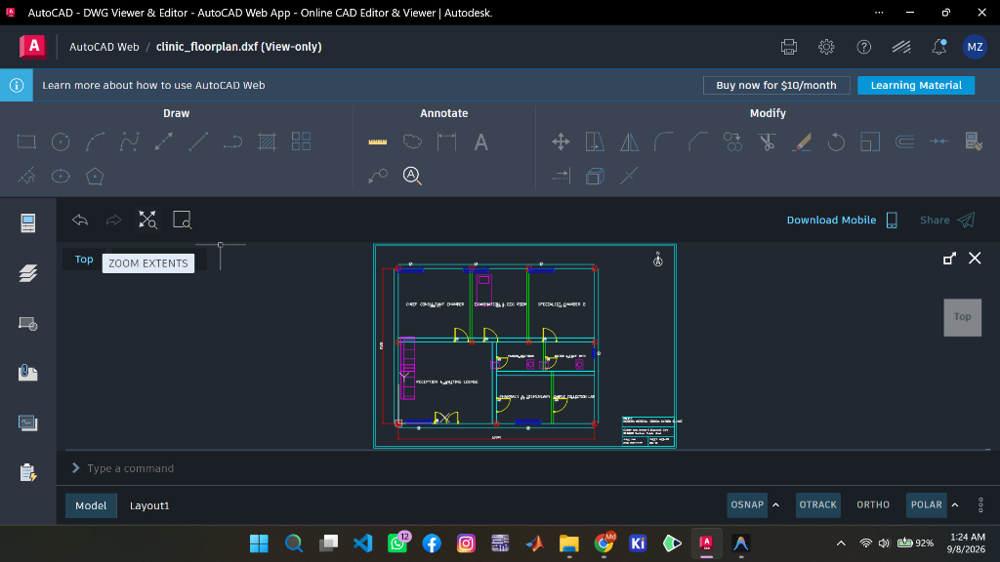
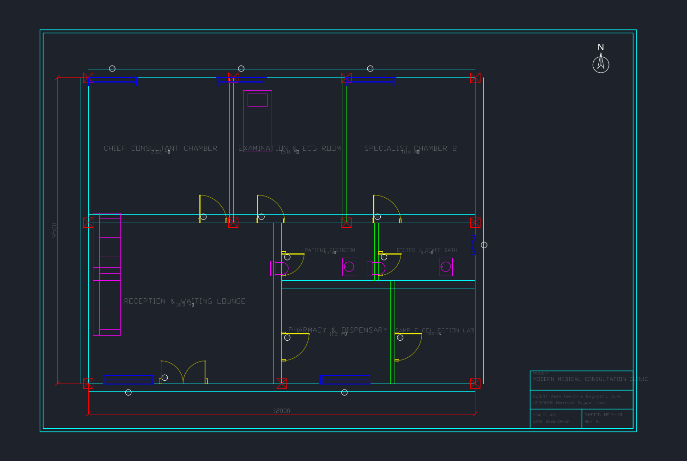
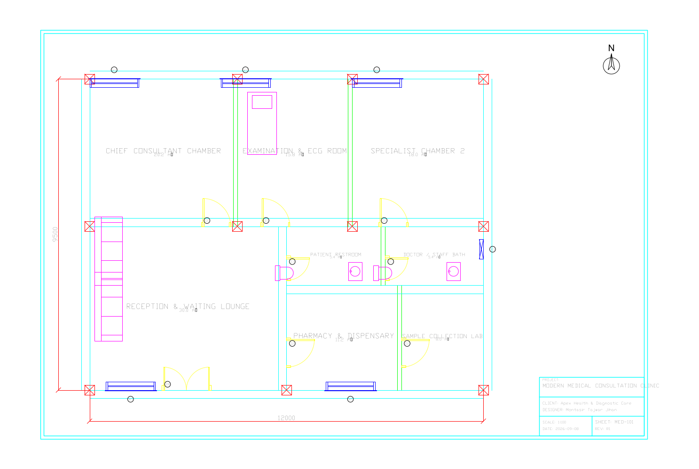
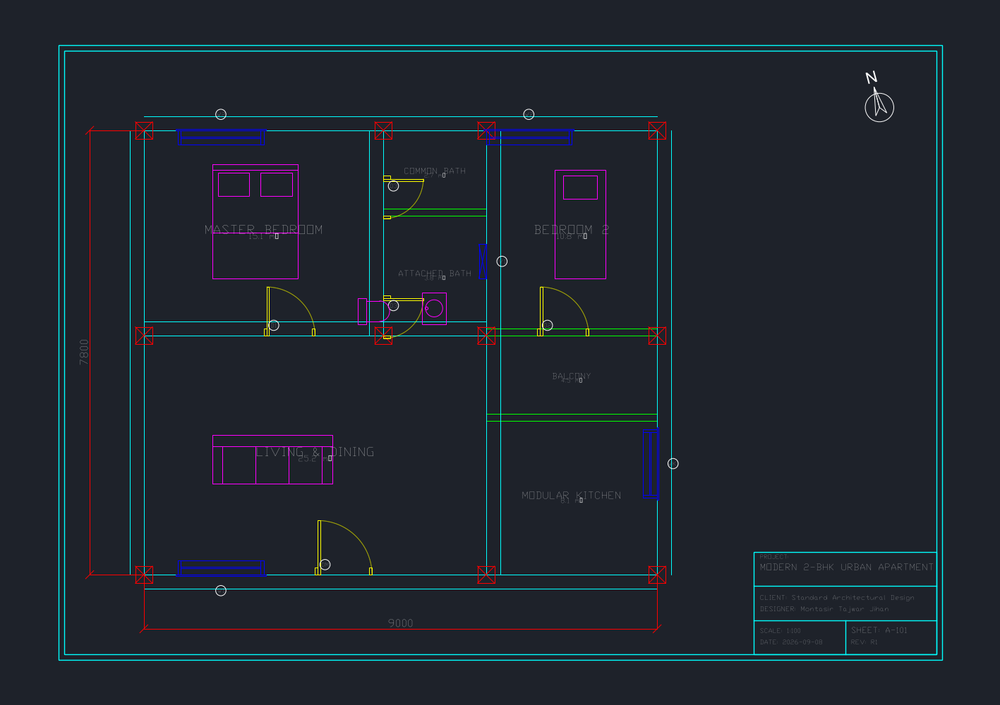
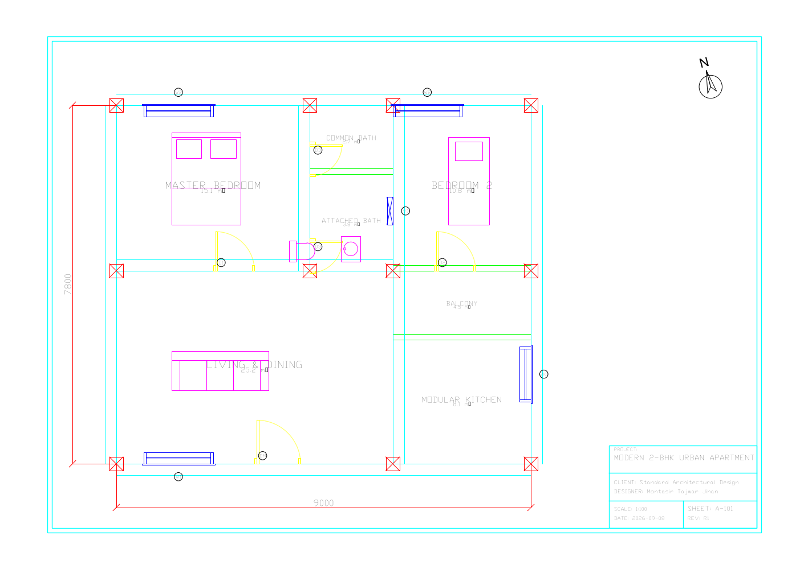

# CadBridge

<p align="center">
  <strong>Autonomous Computational 2D CAD Compiler & Algorithmic Drafting Engine</strong>
</p>

<p align="center">
  <a href="https://github.com/mdzihan0165-stack/cadbridge/blob/main/LICENSE"></a>
  
  
  
  
</p>

---

## 🏛️ Overview

**CadBridge** is an open-source, high-performance computational CAD compilation and spatial constraint solving framework written in Python. It bridges declarative spatial definitions (JSON specifications) directly into production-grade AutoCAD drawings (`.dxf`), without requiring proprietary Autodesk desktop runtimes.

Engineered around **AIA CAD Layer Guidelines** and **ISO 13567** CAD standards, CadBridge automates:
- Precise double-line wall offsets (exterior structural envelope & interior partitions)
- Parametric architectural openings (doors with true 90° swing arcs, window sills, and glazing)
- Intelligent circular tag bubbles and non-overlapping room labels
- Comprehensive dimension lines (`A-ANNO-DIMS`) and architectural title blocks
- Automated Bill of Quantities (BOQ), net carpet area calculations, and door/window schedules (Markdown & CSV)
- Headless, high-resolution raster snapshots (`PNG` / `SVG`) in dark modelspace and light paper styles

---

## 📸 Verified in Autodesk AutoCAD Web

Every DXF drawing generated by CadBridge compiles natively with 100% entity and layer fidelity, verified directly inside **Autodesk's official AutoCAD Web Engine**:

<p align="center">
  
</p>

---

## 🖼️ Architectural Showcase Gallery

<table>
  <tr>
    <td width="50%" align="center">
      <strong>Medical Consultation Clinic (Dark Modelspace)</strong><br/><br/>
      
    </td>
    <td width="50%" align="center">
      <strong>Medical Consultation Clinic (Light Plot View)</strong><br/><br/>
      
    </td>
  </tr>
  <tr>
    <td width="50%" align="center">
      <strong>Modern 2BHK Residential Apartment</strong><br/><br/>
      
    </td>
    <td width="50%" align="center">
      <strong>Modern 2BHK Apartment (Light Plot View)</strong><br/><br/>
      
    </td>
  </tr>
</table>

---

## ⚙️ Architecture & Engine Modules

```
cadbridge/
├── cadbridge/                 # Core engine package
│   ├── core/                  # Data models, AIA layer definitions, parametric blocks
│   │   ├── layers.py          # Standard AIA / ISO 13567 layer configurations
│   │   ├── blocks.py          # Parametric CAD blocks (doors, windows, columns, title stamps)
│   │   └── spec.py            # Specification data models and schema validator
│   ├── compiler/              # DXF geometry synthesis engine
│   │   └── json2dxf.py        # Vector wall offsetting & CAD entity generator
│   ├── solver/                # 2D planar constraint & topological solver
│   │   └── spatial_solver.py  # Relative room placement & boundary verification
│   ├── qa/                    # Headless inspection & rasterization
│   │   └── cad_snapshot.py    # Matplotlib backend renderer (PNG / SVG)
│   └── boq/                   # Quantity takeoff engine
│       └── cad_boq.py         # Area schedules & opening takeoff (MD / CSV)
├── tests/                     # Unit test suite
│   └── test_compiler.py       # Compiler and solver unit tests
├── projects/                  # Architectural benchmark designs
│   ├── modern_2bhk_apartment/ # 850 sq.ft residential 2BHK apartment
│   ├── compact_1bhk_studio/   # 650 sq.ft urban studio apartment
│   └── medical_consultation_clinic/ # 1,200 sq.ft healthcare clinic
├── .github/workflows/         # CI/CD Automated testing pipelines
├── json2dxf.py                # Standalone compiler CLI
├── cad_snapshot.py            # Standalone headless renderer CLI
├── cad_solver.py              # Standalone spatial layout solver CLI
├── cad_boq.py                 # Standalone BOQ generator CLI
└── spec_template.json         # Reference schema template
```

---

## 🚀 Quick Start

### 1. Installation

```bash
# Clone the repository
git clone https://github.com/mdzihan0165-stack/cadbridge.git
cd cadbridge

# Install dependencies
pip install -r requirements.txt

# (Optional) Install in editable development mode
pip install -e .
```

### 2. Compile a Spec to AutoCAD DXF

```bash
# Compile to DXF and automatically render a dark-mode snapshot
python json2dxf.py projects/medical_consultation_clinic/cad_spec.json -o build/clinic.dxf --snapshot --theme dark
```

### 3. Generate Headless Plot Previews (Dark & Light)

```bash
# AutoCAD Model Space (Dark Theme)
python cad_snapshot.py build/clinic.dxf -o build/preview_dark.png --theme dark

# Architectural Paper Plot (Light Theme)
python cad_snapshot.py build/clinic.dxf -o build/preview_light.png --theme light
```

### 4. Extract Automated Bill of Quantities (BOQ)

```bash
python cad_boq.py projects/medical_consultation_clinic/cad_spec.json -o build/boq.md --csv build/rooms.csv
```

### 5. Run 2D Planar Constraint Solver

```bash
python cad_solver.py --test
```

---

## 📊 Sample Quantity Surveying (BOQ) Output

CadBridge automatically computes carpet areas, gross built-up area (BUA), and schedule of openings from the vector model:

```markdown
# Bill of Quantities & Architectural Schedule
**Project:** Modern Medical Consultation Clinic  
**Gross Built-up Area (BUA):** 114.00 m² (1,227.08 sq.ft)  
**Total Net Carpet Area:** 78.47 m² (844.64 sq.ft)  
**Circulation & Wall Efficiency:** 68.8%

### Room Schedule
| Room Name | Area (m²) | Area (sq.ft) | Dimensions (mm) |
|---|---|---|---|
| Reception & Waiting Lounge | 24.28 | 261.35 | 5250 × 4625 |
| Chief Consultant Chamber | 18.06 | 194.40 | 4125 × 4375 |
| Specialist Chamber 2 | 14.77 | 158.98 | 3375 × 4375 |
| Examination & ECG Room | 8.20 | 88.26 | 1875 × 4375 |
| Pharmacy & Dispensary | 6.56 | 70.61 | 2625 × 2500 |
| Sample Collection Lab | 6.56 | 70.61 | 2625 × 2500 |
```

---

## 📐 Standards Compliance

CadBridge strictly enforces industry CAD naming conventions:

| Layer Name | Color | Lineweight | Description |
|---|---|---|---|
| `A-WALL-EXTR` | Cyan (4) | 0.50 mm | Exterior structural walls and building envelope |
| `A-WALL-INTR` | Green (3) | 0.25 mm | Interior partitions and demising walls |
| `A-DOOR` | Yellow (2) | 0.18 mm | Door frames, leaves, and 90° swing arcs |
| `A-GLAZ` | Blue (5) | 0.18 mm | Window assemblies, sills, and glazing |
| `A-COLS` | Red (1) | 0.35 mm | Reinforced concrete columns |
| `A-ANNO-TEXT` | White (7) | 0.15 mm | Centered room designations and area tags |
| `A-ANNO-DIMS` | Red (1) | 0.15 mm | Extension lines, ticks, and dimensional callouts |
| `A-TITL` | Cyan (4) | 0.25 mm | Sheet borders, revision grids, and title block metadata |

---

## 🧪 Automated Testing

Run the full unit test suite with:

```bash
python -m unittest discover tests/
```

---

## 👤 Author & Maintainer

**Montasir Tajwar Jihan**  
*Lead Computational CAD & Architectural Automation Engineer*  
- **GitHub:** [@mdzihan0165-stack](https://github.com/mdzihan0165-stack)  
- **Email:** [mdzihan0165@gmail.com](mailto:mdzihan0165@gmail.com)  

---

## 📄 License

This project is licensed under the **MIT License** — see the [LICENSE](LICENSE) file for details.
